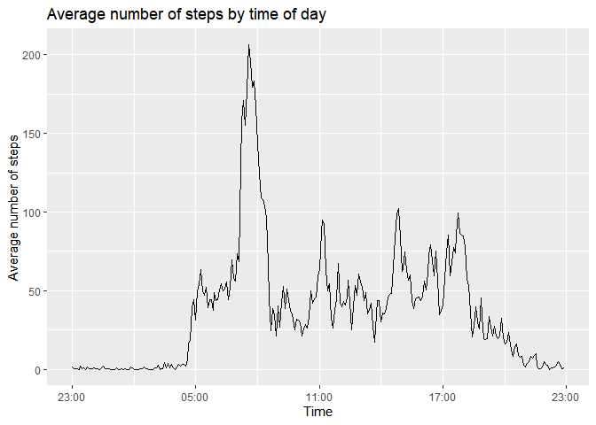
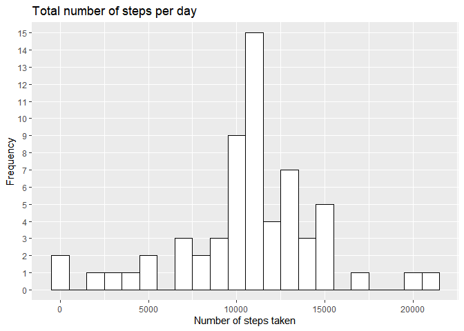
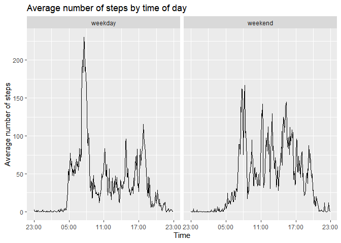

## Loading required packages
Using require() we will load all packages needed for analysis.

```r
require(readr)
```

```
## Loading required package: readr
```

```
## Warning: package 'readr' was built under R version 4.2.2
```

```r
require(ggplot2)
```

```
## Loading required package: ggplot2
```

```
## Warning: package 'ggplot2' was built under R version 4.2.2
```

```r
require(dplyr)
```

```
## Loading required package: dplyr
```

```
## 
## Attaching package: 'dplyr'
```

```
## The following objects are masked from 'package:stats':
## 
##     filter, lag
```

```
## The following objects are masked from 'package:base':
## 
##     intersect, setdiff, setequal, union
```

```r
require(lubridate)
```

```
## Loading required package: lubridate
```

```
## Warning: package 'lubridate' was built under R version 4.2.2
```

```
## Loading required package: timechange
```

```
## Warning: package 'timechange' was built under R version 4.2.2
```

```
## 
## Attaching package: 'lubridate'
```

```
## The following objects are masked from 'package:base':
## 
##     date, intersect, setdiff, union
```

## Loading and preprocessing the data
The data is loaded into a data frame. With readr, most of the data is already in an appropriate format.  

```r
stepsdf <- read_csv("activity.zip")
```

```
## Rows: 17568 Columns: 3
## ── Column specification ────────────────────────────────────────────────────────
## Delimiter: ","
## dbl  (2): steps, interval
## date (1): date
## 
## ℹ Use `spec()` to retrieve the full column specification for this data.
## ℹ Specify the column types or set `show_col_types = FALSE` to quiet this message.
```
Stepsdf contains three columns:
1. steps (numeric), the number of steps on the given date and time. 
2. date (date), the date on which the measurement was taken.
3. interval (numeric), the time in the format HHMM  
The interval column is used to extract the time, and this is combined with the date to create a datetime value.

```r
stepsdf <- stepsdf %>%
    mutate(datetime = date + hours((interval - (interval %% 100)) / 100) + minutes(interval %% 100))
```

## What is mean total number of steps taken per day?
First we sum all values of 'steps', grouped by day, using the 'aggregate' function:

```r
steps_per_day <- aggregate(stepsdf$steps, by=list(stepsdf$date), sum)
names(steps_per_day) <- c("Date", "Total_steps")
```
Steps_per_day now contains two columns: a date and the total number of steps taken on that day.  
Now we will use ggplot to create a histogram:  

```r
g <- ggplot(steps_per_day, aes(x = Total_steps))
g + geom_histogram(binwidth = 1000, color = 'black', fill = 'white') + scale_y_discrete(limits = seq(0, 10)) + labs(title = 'Total number of steps per day', x = 'Number of steps taken', y = 'Frequency')
```

```
## Warning: Continuous limits supplied to discrete scale.
## ℹ Did you mean `limits = factor(...)` or `scale_*_continuous()`?
```

```
## Warning: Removed 8 rows containing non-finite values (`stat_bin()`).
```

<!-- -->
  
Next, we will calculate the mean and median number of total steps taken per day (so the sum of all steps taken daily). 

```r
cat('Mean:   ', mean(steps_per_day$Total_steps, na.rm = TRUE), "\n")
```

```
## Mean:    10766.19
```

```r
cat('Median: ', median(steps_per_day$Total_steps, na.rm = TRUE))
```

```
## Median:  10765
```

## What is the average daily activity pattern?

```r
steps_per_interval <- aggregate(stepsdf$steps, by=list(stepsdf$interval), mean, na.rm = TRUE)
names(steps_per_interval) <- c("Interval", "Avg_steps")
steps_per_interval <- steps_per_interval %>%
    mutate(time = strptime((Interval - (Interval %% 100)) / 100, format = "%H") + (Interval %% 100 * 60))

g <- ggplot(steps_per_interval, aes(x = time, y = Avg_steps))
g + geom_line() + labs(title = 'Average number of steps by time of day', x = 'Time', y = 'Average number of steps') + scale_x_datetime(date_labels = "%H:%M")
```

<!-- -->
  

## Imputing missing values
First we must identify how many missing values are present in the dataset:

```r
str(stepsdf) # This indicates that date and interval are system/device generated, so they are unlikely to be missing 
```

```
## tibble [17,568 × 4] (S3: tbl_df/tbl/data.frame)
##  $ steps   : num [1:17568] NA NA NA NA NA NA NA NA NA NA ...
##  $ date    : Date[1:17568], format: "2012-10-01" "2012-10-01" ...
##  $ interval: num [1:17568] 0 5 10 15 20 25 30 35 40 45 ...
##  $ datetime: POSIXct[1:17568], format: "2012-10-01 00:00:00" "2012-10-01 00:05:00" ...
```

```r
table(is.na(stepsdf)) # 2304 missing values in 50400 total data points
```

```
## 
## FALSE  TRUE 
## 67968  2304
```

```r
table(is.na(stepsdf$steps)) # This tells us that there are indeed 2304 missing values in 'steps'.
```

```
## 
## FALSE  TRUE 
## 15264  2304
```
From the average daily activity pattern, we can see that there are definitely differences in what the best replacement is. We will replace NA's with the rounded average number of steps in the same interval. So, for example, if there is a measurement missing at the interval 835, we would replace it with 206. 
To achieve this, an extra column is added to stepsdf which repeats the average number of steps calculated in the previous part. This works because the intervals are ordered and repeat consistently.  

```r
stepsdf$avg_steps_this_interval <- rep(round(steps_per_interval$Avg_steps), times = nrow(stepsdf) / nrow(steps_per_interval)) 
```
Now all that is left to do is replace the NA's in *steps* with the (rounded) value in *avg_steps_this_interval*, and store this in a new dataframe (stepsdf2).

```r
stepsdf2 <- stepsdf %>%
    mutate(steps = coalesce(steps, avg_steps_this_interval))
```
### Analysis of the effect of imputing missing data values
This is similar to the previous section [What is mean total number of steps taken per day?]
*Create aggregate column for sum of steps per day*  

```r
steps_per_day2 <- aggregate(stepsdf2$steps, by=list(stepsdf2$date), sum)
names(steps_per_day2) <- c("Date", "Total_steps")
```
*Create a histogram*  

```r
g <- ggplot(steps_per_day2, aes(x = Total_steps))
g + geom_histogram(binwidth = 1000, color = 'black', fill = 'white') + scale_y_discrete(limits = seq(0, 15)) + labs(title = 'Total number of steps per day', x = 'Number of steps taken', y = 'Frequency')
```

```
## Warning: Continuous limits supplied to discrete scale.
## ℹ Did you mean `limits = factor(...)` or `scale_*_continuous()`?
```

<!-- -->
  
*Calculate mean and median*

```r
cat('Mean:   ', mean(steps_per_day2$Total_steps, na.rm = TRUE), "\n")
```

```
## Mean:    10765.64
```

```r
cat('Median: ', median(steps_per_day2$Total_steps, na.rm = TRUE))
```

```
## Median:  10762
```
There are minor differences (without imputation we get a mean of 10766.19 and a median of 10765), but the differences are quite small. It is remarkable that with imputation we get 15 days of 11000 steps, and without only 7.
## Are there differences in activity patterns between weekdays and weekends?
We create a column based on date that contains weekend/weekday as a factor.

```r
stepsdf2 <- stepsdf2 %>%
    mutate(Weekday = case_when(
        strftime(date, format = '%w') %in% c(0,6) ~ 'weekend', 
        strftime(date, format = '%w') %in% c(seq(1,5)) ~ 'weekday'
    ))
stepsdf2$Weekday <- as.factor(stepsdf2$Weekday)
```
Now we create a similar plot to what is done in[What is the average daily activity pattern?], but we split the resulting panels based on weekday.  

```r
steps_per_interval2 <- aggregate(steps ~ interval + Weekday, data = stepsdf2, mean, na.rm = TRUE)
steps_per_interval2 <- steps_per_interval2 %>%
    mutate(time = strptime((interval - (interval %% 100)) / 100, format = "%H") + (interval %% 100 * 60))

g <- ggplot(steps_per_interval2, aes(x = time, y = steps))
g + geom_line() + labs(title = 'Average number of steps by time of day', x = 'Time', y = 'Average number of steps') + scale_x_datetime(date_labels = "%H:%M") + facet_grid(.~Weekday)
```

<!-- -->
  
In this plot we can see side by side that on weekdays there is a spike around 8AM on weekdays that is less prevalent on weekends, while on weekends there is a more consistent activity throughout the day. 
